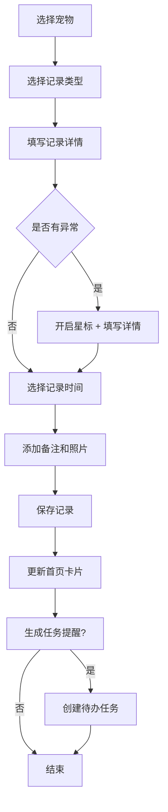
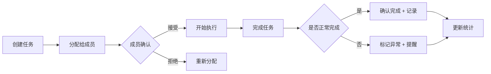
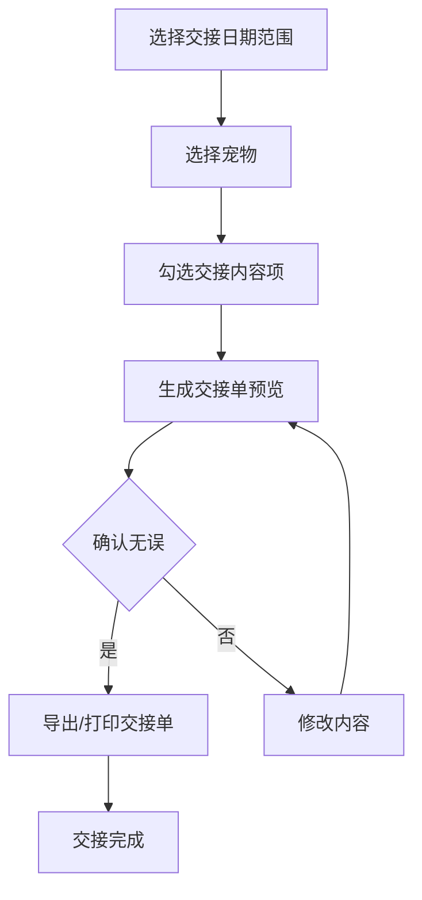

# 宠物日记本小程序 - 产品需求文档

## 1. 产品概述

专为多宠家庭设计的照护记录管理工具，帮助家庭成员分工协作追踪每只宠物的健康状况、护理任务和异常情况。通过可视化的卡片、时间轴和统计报表，让新手家人快速接手照护工作，实现无缝的宠物看护交接。

**核心价值**：
- 多宠分开管理，清晰追踪每只宠物的独立档案
- 家庭协作分工，任务分配和完成确认
- 异常情况星标标记，及时发现健康问题
- 一键生成看护交接单，方便寄养或家人接手

**目标用户**：养有多只宠物的家庭成员，尤其是需要轮流照顾宠物的家庭

---

## 2. 核心功能模块

### 2.1 首页（宠物卡片概览）
- 宠物头像和基本信息卡片列表
- 每张卡片展示：
  - 宠物名称、物种、年龄
  - 今日待办任务数量（未完成/总数）
  - 最新健康状态指示（正常/需关注/异常）
  - 最近3条护理记录预览
- 快捷添加记录按钮
- 顶部筛选：全部宠物 / 单只宠物

### 2.2 新增记录页
支持多种记录类型：
| 记录类型 | 记录字段 |
|---------|---------|
| 喂药记录 | 药品名称、剂量、单位、是否完成、副作用观察 |
| 体重记录 | 体重数值、单位(kg/g)、记录时间 |
| 精神状态 | 状态选项(活泼/正常/萎靡/嗜睡)、详细描述 |
| 食欲记录 | 食欲等级(1-5星)、进食量、食物种类、备注 |
| 过敏反应 | 过敏源、反应症状、严重程度、处理措施 |
| 外出散步 | 散步时长、距离、路线描述、天气状况 |
| 排便记录 | 形态(正常/稀软/干硬)、颜色、频率、备注 |
| 呕吐记录 | 呕吐物描述、频率、是否禁食、处理方式 |

- 关联宠物选择（单选）
- 记录时间（默认当前时间，可手动调整）
- 备注信息
- 异常标记开关（开启后自动星标）
- 拍照上传功能

### 2.3 时间轴页
- 垂直时间轴展示所有护理记录
- 顶部宠物筛选器：单只宠物 / 全部宠物
- 按日期分组显示
- 每条记录显示：
  - 记录类型图标
  - 记录摘要
  - 记录时间和操作人
  - 星标异常标记
- 支持按记录类型筛选
- 点击记录可查看详情

### 2.4 成员管理页
- 家庭成员列表
- 成员信息：头像、昵称、联系方式
- 任务分配功能：
  - 可分配任务类型：铲屎、遛狗、喂食、洗澡、驱虫、就医、其他
  - 分配给指定成员
  - 设置截止时间
  - 任务优先级（普通/重要/紧急）
- 任务状态：待确认 → 进行中 → 已完成
- 任务完成确认功能
- 任务完成统计（本周完成数、按时完成率）

### 2.5 提醒页
- 周期提醒列表
- 提醒类型：
  - 每日提醒：喂食时间、遛狗时间、喂药时间
  - 每周提醒：洗澡、清洁笼子
  - 每月提醒：驱虫、体检
  - 自定义周期：间隔天数
- 提醒设置：
  - 关联宠物
  - 提醒时间
  - 重复周期
  - 提醒方式（应用内通知）
- 提醒到期自动生成待办任务

### 2.6 统计页
- 宠物选择器（单只/全部）
- 体重变化曲线图（近30天/90天/一年）
- 护理频率统计：
  - 各类型护理完成率
  - 每日/每周任务完成趋势
- 健康状态分布（正常/需关注/异常占比）
- 过敏反应记录频率
- 异常记录高发期分析

### 2.7 看护交接单
- 日期范围选择（开始日期 ~ 结束日期）
- 选择要交接的宠物
- 选择交接内容：
  - 宠物基本信息
  - 当前健康状态
  - 近期待办任务
  - 护理习惯和注意事项
  - 近期异常记录
  - 用药情况
- 预览交接单样式
- 导出方式：打印 / 保存为PDF

---

## 3. 核心业务流程

### 3.1 添加护理记录流程


### 3.2 任务分配与完成流程


### 3.3 看护交接流程


---

## 4. 用户界面设计

### 4.1 设计风格
**设计主题**：温暖治愈的宠物生活美学

**配色方案**：
- 主色：柔和的珊瑚橙 `#FF8A65`（温暖、活力）
- 辅助色：薄荷绿 `#81C784`（健康、自然）
- 警示色：琥珀黄 `#FFD54F`（注意）、玫红 `#E57373`（异常）
- 背景色：米白色 `#FFF8F0`（温馨）
- 文字色：深棕色 `#5D4037`（柔和易读）
- 卡片色：纯白 `#FFFFFF`（清晰层次）

**按钮风格**：
- 圆角按钮（border-radius: 12px）
- 悬停时微微上浮 + 阴影加深
- 主按钮：填充珊瑚橙 + 白色文字
- 次按钮：边框 + 珊瑚橙文字
- 圆角图标按钮用于操作

**字体**：
- 标题：思源黑体 Bold / Noto Sans SC Bold，24-32px
- 副标题：思源黑体 Medium / Noto Sans SC Medium，18-20px
- 正文：思源黑体 Regular / Noto Sans SC Regular，14-16px
- 辅助文字：12px，#9E9E9E

**布局**：
- 底部导航栏（5个主要入口）
- 卡片式内容布局
- 列表页使用分组卡片
- 表单页使用垂直表单布局
- 统计页使用图表卡片

**图标风格**：
- 使用圆润可爱的线性图标
- 每种宠物类型有专属图标
- 每种记录类型有对应的彩色图标
- 表情符号用于状态标识

### 4.2 页面设计概览

#### 首页
| 模块 | 设计元素 |
|-----|---------|
| 宠物卡片 | 圆角卡片 + 阴影，宠物头像（圆形），名称和品种，健康状态色条 |
| 待办指示 | 徽章样式，显示数字，圆角背景 |
| 状态指示 | 彩色圆点 + 文字标签（正常:绿，需关注:黄，异常:红） |
| 快捷操作 | 浮动操作按钮，底部弹出菜单 |

#### 新增记录页
| 模块 | 设计元素 |
|-----|---------|
| 类型选择 | 网格布局，图标 + 文字，选中态高亮 |
| 表单 | 标签在上，输入框在下，间距16px |
| 开关控件 | 圆角滑块，绿色激活态 |
| 提交按钮 | 全宽主按钮，固定在底部 |

#### 时间轴页
| 模块 | 设计元素 |
|-----|---------|
| 时间轴线 | 左侧垂直线，渐变色，圆点节点 |
| 日期分组 | 固定在顶部，时间标签 |
| 记录卡片 | 右侧展开，信息分层展示 |
| 筛选栏 | 顶部横向滚动，胶囊样式标签 |

#### 成员页
| 模块 | 设计元素 |
|-----|---------|
| 成员卡片 | 头像 + 昵称 + 任务统计 |
| 任务列表 | 待办卡片，优先级色条，勾选完成 |
| 分配弹窗 | 底部弹出，选择成员 + 时间 |

#### 提醒页
| 模块 | 设计元素 |
|-----|---------|
| 提醒卡片 | 图标 + 标题 + 时间，循环图标指示 |
| 状态切换 | 开启/关闭滑块 |
| 编辑表单 | 时间选择器 + 周期选择器 |

#### 统计页
| 模块 | 设计元素 |
|-----|---------|
| 宠物选择 | 头像切换，下划线指示选中 |
| 图表区 | 卡片包裹，图表标题 |
| 趋势图 | 折线图，渐变填充，数据点标注 |
| 统计卡片 | 数字 + 标签 + 趋势指示 |

#### 交接单页
| 模块 | 设计元素 |
|-----|---------|
| 日期选择 | 范围选择器，起止日期 |
| 内容勾选 | 多选框列表，带说明文字 |
| 预览区 | A4比例预览，分页样式 |
| 导出按钮 | 主按钮 + 次按钮组合 |

### 4.3 响应式设计
- **移动端优先**（主要使用场景）
- 屏幕宽度适配：320px - 428px
- 触摸优化：按钮最小点击区域 44px
- 手势支持：下拉刷新、上拉加载更多
- 安全区域适配：底部导航适配刘海屏

---

## 5. 数据存储

### 5.1 本地数据模型
- 使用 localStorage 存储应用数据
- 数据结构：宠物档案、护理记录、任务、提醒、家庭成员
- 自动备份机制

### 5.2 预设宠物档案
演示数据包含3只宠物：
1. 小橘猫（猫咪，2岁，公）
2. 豆豆（柴犬，3岁，母）
3. 小白兔（兔子，1岁，公）

---

## 6. 技术实现

### 6.1 技术栈
- **前端框架**：React 18
- **样式方案**：TailwindCSS 3
- **图表库**：Chart.js + react-chartjs-2
- **图标**：Lucide React
- **状态管理**：React Context
- **路由**：React Router v6
- **构建工具**：Vite
- **日期处理**：dayjs

### 6.2 项目结构
```
src/
├── components/     # 可复用组件
├── pages/          # 页面组件
├── context/        # 全局状态管理
├── hooks/          # 自定义Hooks
├── utils/          # 工具函数
├── data/           # 模拟数据
└── styles/         # 全局样式
```

---

## 7. 验收标准

- [ ] 首页正确显示所有宠物卡片
- [ ] 可以添加各种类型的护理记录
- [ ] 时间轴正确筛选单只/全部宠物记录
- [ ] 成员任务分配和完成功能正常
- [ ] 提醒设置和触发功能完整
- [ ] 统计图表正确显示数据
- [ ] 异常记录星标功能正常
- [ ] 看护交接单生成和预览功能正常
- [ ] 所有页面切换流畅，动画自然
- [ ] 移动端显示正常，触摸操作流畅
