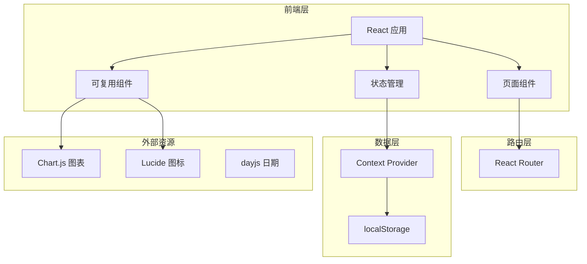
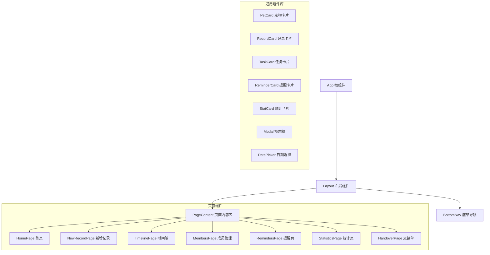

# 宠物日记本小程序 - 技术架构文档

## 1. 架构设计

### 1.1 系统架构图


### 1.2 组件架构


---

## 2. 技术选型

| 技术项 | 选型方案 | 版本 | 说明 |
|-------|---------|------|------|
| 前端框架 | React | 18.x | 函数组件 + Hooks |
| 路由管理 | React Router | v6 | SPA路由 |
| 样式方案 | TailwindCSS | 3.x | 原子化CSS |
| 图表库 | Chart.js + react-chartjs-2 | 4.x | 轻量级图表 |
| 图标库 | Lucide React | 最新 | 线性图标 |
| 日期处理 | dayjs | 1.x | 轻量级日期库 |
| 状态管理 | React Context | 内置 | 全局状态 |
| 构建工具 | Vite | 5.x | 快速构建 |

---

## 3. 路由定义

| 路由路径 | 页面名称 | 功能描述 |
|---------|---------|---------|
| `/` | 首页 | 宠物卡片列表、快捷操作 |
| `/record/new` | 新增记录 | 添加护理记录 |
| `/record/:id` | 记录详情 | 查看单条记录 |
| `/timeline` | 时间轴 | 查看护理历史 |
| `/members` | 成员管理 | 家庭成员和任务 |
| `/reminders` | 提醒管理 | 设置周期提醒 |
| `/statistics` | 统计分析 | 查看健康统计 |
| `/handover` | 看护交接 | 生成交接单 |

---

## 4. 数据模型

### 4.1 宠物档案 (Pet)
```typescript
interface Pet {
  id: string;
  name: string;              // 宠物名称
  species: 'cat' | 'dog' | 'rabbit' | 'other';  // 物种
  breed?: string;            // 品种
  age: number;               // 年龄（岁）
  gender: 'male' | 'female'; // 性别
  avatar?: string;           // 头像URL
  weight?: number;           // 当前体重
  healthStatus: 'normal' | 'attention' | 'abnormal';  // 健康状态
  createdAt: string;         // 创建时间
  updatedAt: string;         // 更新时间
}
```

### 4.2 护理记录 (CareRecord)
```typescript
interface CareRecord {
  id: string;
  petId: string;             // 关联宠物ID
  type: 'medication' | 'weight' | 'mood' | 'appetite' | 'allergy' | 'walk' | 'defecation' | 'vomit';
  content: Record<string, any>;  // 记录内容（类型相关）
  isStarred: boolean;        // 是否星标异常
  recordTime: string;        // 记录时间
  createdBy: string;         // 创建人ID
  photos?: string[];         // 照片URL数组
  notes?: string;            // 备注
  createdAt: string;
}
```

### 4.3 家庭成员 (FamilyMember)
```typescript
interface FamilyMember {
  id: string;
  name: string;              // 成员名称
  avatar?: string;           // 头像
  role: 'owner' | 'member';  // 角色
  contact?: string;          // 联系方式
  stats: {
    totalTasks: number;      // 总任务数
    completedTasks: number;  // 已完成任务数
    onTimeRate: number;      // 按时完成率
  };
  createdAt: string;
}
```

### 4.4 任务 (Task)
```typescript
interface Task {
  id: string;
  title: string;              // 任务标题
  type: 'scoop' | 'walk' | 'feed' | 'bath' | 'deworm' | 'medical' | 'other';
  petId?: string;            // 关联宠物（可选）
  assignedTo: string;        // 分配给成员ID
  priority: 'normal' | 'important' | 'urgent';
  status: 'pending' | 'in_progress' | 'completed';
  dueDate: string;           // 截止日期
  completedAt?: string;      // 完成时间
  createdAt: string;
}
```

### 4.5 提醒 (Reminder)
```typescript
interface Reminder {
  id: string;
  title: string;             // 提醒标题
  petId?: string;            // 关联宠物
  time: string;              // 提醒时间 (HH:mm)
  repeatType: 'daily' | 'weekly' | 'monthly' | 'custom';
  repeatInterval?: number;   // 自定义间隔天数
  weekDays?: number[];        // 每周哪些天 (0-6)
  isEnabled: boolean;        // 是否启用
  createdAt: string;
}
```

---

## 5. 全局状态管理

### 5.1 Context Providers
```typescript
// 应用状态上下文
interface AppState {
  pets: Pet[];
  records: CareRecord[];
  members: FamilyMember[];
  tasks: Task[];
  reminders: Reminder[];
}

// 操作方法
interface AppActions {
  // 宠物操作
  addPet: (pet: Omit<Pet, 'id' | 'createdAt' | 'updatedAt'>) => void;
  updatePet: (id: string, updates: Partial<Pet>) => void;
  deletePet: (id: string) => void;
  
  // 记录操作
  addRecord: (record: Omit<CareRecord, 'id' | 'createdAt'>) => void;
  updateRecord: (id: string, updates: Partial<CareRecord>) => void;
  deleteRecord: (id: string) => void;
  
  // 任务操作
  addTask: (task: Omit<Task, 'id' | 'createdAt'>) => void;
  updateTask: (id: string, updates: Partial<Task>) => void;
  completeTask: (id: string) => void;
  
  // 提醒操作
  addReminder: (reminder: Omit<Reminder, 'id' | 'createdAt'>) => void;
  updateReminder: (id: string, updates: Partial<Reminder>) => void;
  deleteReminder: (id: string) => void;
  
  // 成员操作
  addMember: (member: Omit<FamilyMember, 'id' | 'createdAt' | 'stats'>) => void;
  updateMember: (id: string, updates: Partial<FamilyMember>) => void;
}
```

---

## 6. 组件清单

### 6.1 布局组件
| 组件名 | 功能描述 | 位置 |
|-------|---------|------|
| Layout | 页面布局容器 | layout/Layout.tsx |
| BottomNav | 底部导航栏 | components/BottomNav.tsx |
| Header | 页面标题栏 | components/Header.tsx |

### 6.2 通用组件
| 组件名 | 功能描述 |
|-------|---------|
| Button | 按钮组件，支持多种样式和尺寸 |
| Input | 输入框组件 |
| Select | 选择器组件 |
| Modal | 模态框组件 |
| DatePicker | 日期选择器 |
| TimePicker | 时间选择器 |
| Avatar | 头像组件 |
| Badge | 徽章组件 |
| Card | 卡片组件 |
| Empty | 空状态组件 |
| Loading | 加载状态组件 |

### 6.3 业务组件
| 组件名 | 功能描述 | 所在页面 |
|-------|---------|---------|
| PetCard | 宠物卡片 | 首页 |
| PetSelector | 宠物选择器 | 新增记录 |
| RecordTypeGrid | 记录类型网格 | 新增记录 |
| RecordForm | 记录表单 | 新增记录 |
| RecordCard | 记录卡片 | 时间轴 |
| Timeline | 时间轴组件 | 时间轴 |
| MemberCard | 成员卡片 | 成员管理 |
| TaskCard | 任务卡片 | 成员管理 |
| TaskForm | 任务表单 | 成员管理 |
| ReminderCard | 提醒卡片 | 提醒管理 |
| ReminderForm | 提醒表单 | 提醒管理 |
| WeightChart | 体重图表 | 统计页 |
| StatCard | 统计卡片 | 统计页 |
| HandoverPreview | 交接单预览 | 交接单 |

---

## 7. 工具函数

### 7.1 数据处理
```typescript
// 日期格式化
formatDate(date: string | Date, format?: string): string;

// 获取今日待办
getTodayTasks(tasks: Task[]): Task[];

// 筛选宠物记录
filterRecordsByPet(records: CareRecord[], petId: string): CareRecord[];

// 计算任务完成率
calculateCompletionRate(tasks: Task[]): number;

// 生成唯一ID
generateId(): string;
```

### 7.2 数据持久化
```typescript
// 保存到本地存储
saveToStorage(key: string, data: any): void;

// 从本地存储读取
loadFromStorage<T>(key: string, defaultValue: T): T;

// 清除数据
clearStorage(): void;
```

---

## 8. 初始数据

### 8.1 宠物数据
```typescript
const initialPets: Pet[] = [
  {
    id: 'pet-1',
    name: '小橘',
    species: 'cat',
    breed: '橘猫',
    age: 2,
    gender: 'male',
    weight: 4.5,
    healthStatus: 'normal'
  },
  {
    id: 'pet-2',
    name: '豆豆',
    species: 'dog',
    breed: '柴犬',
    age: 3,
    gender: 'female',
    weight: 12.3,
    healthStatus: 'normal'
  },
  {
    id: 'pet-3',
    name: '小白',
    species: 'rabbit',
    breed: '垂耳兔',
    age: 1,
    gender: 'male',
    weight: 2.1,
    healthStatus: 'attention'
  }
];
```

### 8.2 成员数据
```typescript
const initialMembers: FamilyMember[] = [
  {
    id: 'member-1',
    name: '爸爸',
    role: 'owner',
    stats: { totalTasks: 45, completedTasks: 42, onTimeRate: 0.93 }
  },
  {
    id: 'member-2',
    name: '妈妈',
    role: 'owner',
    stats: { totalTasks: 52, completedTasks: 50, onTimeRate: 0.96 }
  },
  {
    id: 'member-3',
    name: '小明',
    role: 'member',
    stats: { totalTasks: 30, completedTasks: 25, onTimeRate: 0.83 }
  }
];
```

---

## 9. 样式规范

### 9.1 TailwindCSS 配置
```javascript
// tailwind.config.js
module.exports = {
  content: ['./index.html', './src/**/*.{js,ts,jsx,tsx}'],
  theme: {
    extend: {
      colors: {
        primary: '#FF8A65',
        secondary: '#81C784',
        warning: '#FFD54F',
        danger: '#E57373',
        background: '#FFF8F0',
        text: '#5D4037',
        muted: '#9E9E9E'
      },
      borderRadius: {
        'xl': '12px',
        '2xl': '16px'
      }
    }
  }
}
```

### 9.2 常用样式类
| 用途 | Tailwind 类 |
|-----|------------|
| 主按钮 | `bg-primary text-white px-6 py-3 rounded-xl hover:bg-opacity-90` |
| 次按钮 | `border-2 border-primary text-primary px-6 py-3 rounded-xl` |
| 卡片 | `bg-white rounded-2xl shadow-lg p-4` |
| 输入框 | `border border-gray-200 rounded-xl px-4 py-3 focus:border-primary` |
| 标签 | `bg-primary bg-opacity-10 text-primary px-3 py-1 rounded-full text-sm` |
| 圆角头像 | `rounded-full object-cover` |
| 底部安全区 | `pb-safe` |

---

## 10. 性能优化

### 10.1 组件优化
- 使用 `React.memo` 优化宠物卡片、记录卡片
- 使用 `useMemo` 缓存筛选后的数据
- 使用 `useCallback` 缓存回调函数

### 10.2 数据加载
- 延迟加载非关键组件
- 使用虚拟列表优化长列表（时间轴）
- 图片懒加载

### 10.3 状态更新
- 批量更新相关状态
- 使用 Immer 优化深层对象更新
